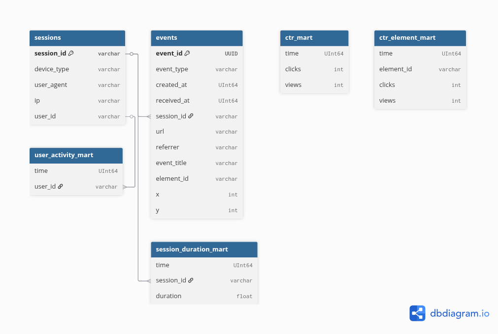

# Clickstream-аналитика

## Введение

### Описание проекта

Проект направлен на аналитику событий (показов/кликов).

### Стек технологий

- Clickhouse
- Kafka
- Prefect
- Python
- Grafana
- FastAPI

### Запуск

Чтобы запустить проект, выполните
```
python3 server.py
```
```
python3 consumer.py
```
```
python3 etl.py
```
```
docker compose up -d
```
Проект запускается локально

## Анализ предметной области

Архитектура приложения обоснована требованиями к курсовому проекту. В БД хранятся таблицы с нормализованными данныыми,
также имеются витрины данных для удобных запросов в Grafana. Данные поступают на сервер, в файлы или в топики брокера сообщений,
далее переходят по etl-пайплайну в хранилище.

- В качестве оркестратора потоков данных используется prefect, т.к. это самое легковесное решение, подходящее под задачи курсового проекта
- В качестве GUI для отображения графиков используется Grafana, т.к. она не требует множества разных сервисов и настроек по сравнениею с Superset,
достаточно 1 контейнера
- Язык программирования - Python, т.к. на нем удобно работать с данными, потому что написано множество удобных библиотек и фреймворков
- База данных - Clickhouse, т.к. нам важны большие аналитические запросы, затрагивающие множество строк. Транзакции - напротив,
нам неважны.

### Диаграмма работы сервиса


### Диаграмма таблиц


### REST API
POST - /events
Пример body
```
[
    {
        "type": "click",
        "session_id": "user-session-1001",
        "user_id": 1001,
        "url": "/catalog?foo=bar",
        "created_at": "2025-01-01T10:00:00Z",
        "user_agent": "Mozilla/5.0 (Linux; Android 7.1.1; SM-J700T1) AppleWebKit/537.36 (KHTML, like Gecko) Chrome/78.0.3882.0",
        "payload": {
            "event_title": "checkout",
            "element_id": "#submit-button"
            "x": 445,
            "y": 315,
        }
    }
]
```

# Заключение

В ходе выполнения курсового проекта я ознакомился с построением витрин данных, батчевой и потоковой обработкой данных
